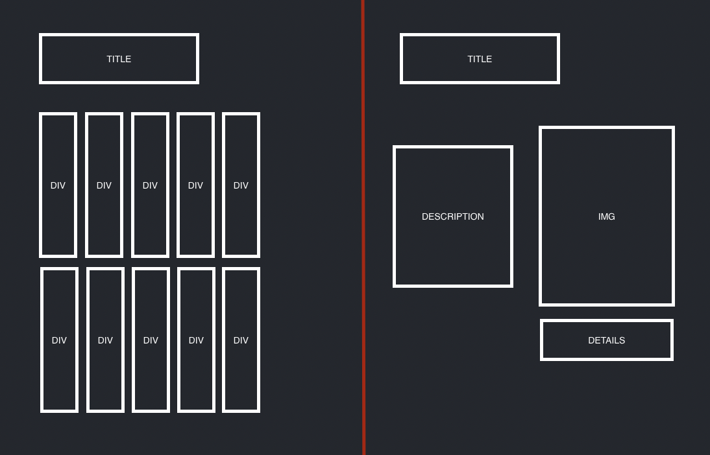

# HTML

-   home page
    -   section to display books
-   details page
    -   section to display details

# STATE

-   fetch-utils.js
    -   fetch all books
    -   fetch 1 book

# EVENTS

-   On load:

    -   request list of books from supabase
    -   add data to state
    -   loop through the data
        -   For each book:
            -   render div
            -   append div
    -   display list of books

-   On clicking book from list:
    -   reference URL to collect id
    -   request single book from supabase using id
    -   add book data to state
        -   render div
        -   append div
    -   display book details div
